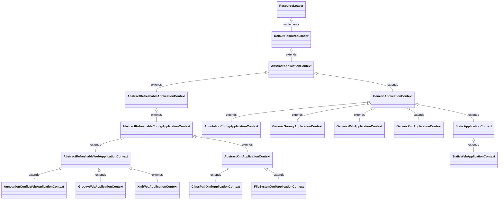

# AbstractApplicationContext

```mermaid
classDiagram
    DefaultResourceLoader <|-- AbstractApplicationContext:extends
    AbstractApplicationContext <|-- GenericApplicationContext:extends
    AbstractApplicationContext <|-- AbstractRefreshableApplicationContext:extends
    AbstractRefreshableApplicationContext <|-- AbstractRefreshableConfigApplicationContext:extends
    AbstractRefreshableConfigApplicationContext <|-- AbstractRefreshableWebApplicationContext:extends
    AbstractRefreshableConfigApplicationContext <|-- AbstractXmlApplicationContext:extends
    AbstractXmlApplicationContext <|-- ClassPathXmlApplicationContext:extends
    AbstractXmlApplicationContext <|-- FileSystemXmlApplicationContext:extends
    AbstractRefreshableWebApplicationContext <|-- AnnotationConfigWebApplicationContext:extends
    AbstractRefreshableWebApplicationContext <|-- GroovyWebApplicationContext:extends
    AbstractRefreshableWebApplicationContext <|-- XmlWebApplicationContext:extends

    GenericApplicationContext <|-- AnnotationConfigApplicationContext: extends
    GenericApplicationContext <|-- GenericGroovyApplicationContext: extends
    GenericApplicationContext <|-- GenericWebApplicationContext: extends
    GenericApplicationContext <|-- GenericXmlApplicationContext: extends
    GenericApplicationContext <|-- StaticApplicationContext: extends
    StaticApplicationContext <|-- StaticWebApplicationContext: extends
    
    ResourceLoader <|-- DefaultResourceLoader:implements
```