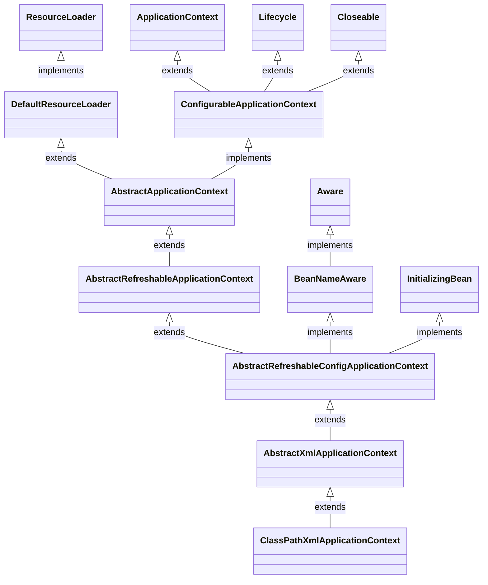

# AbstractXmlApplicationContext

```mermaid
classDiagram
    AbstractXmlApplicationContext <|-- ClassPathXmlApplicationContext : extends
    AbstractRefreshableConfigApplicationContext <|-- AbstractXmlApplicationContext : extends
    AbstractRefreshableApplicationContext <|-- AbstractRefreshableConfigApplicationContext : extends
    AbstractApplicationContext <|-- AbstractRefreshableApplicationContext : extends
    DefaultResourceLoader <|-- AbstractApplicationContext : extends
    ApplicationContext <|-- ConfigurableApplicationContext: extends
    Lifecycle <|-- ConfigurableApplicationContext: extends
    Closeable <|-- ConfigurableApplicationContext: extends
%%    EnvironmentCapable <|-- ApplicationContext: extends
%%    ListableBeanFactory <|-- ApplicationContext: extends
%%    HierarchicalBeanFactory <|-- ApplicationContext: extends
%%    MessageSource <|-- ApplicationContext: extends
%%    ApplicationEventPublisher <|-- ApplicationContext: extends
%%    ResourcePatternResolver <|-- ApplicationContext: extends
%%    ResourceLoader <|-- ResourcePatternResolver: extends
%%    BeanFactory <|-- ListableBeanFactory: extends
%%    BeanFactory <|-- HierarchicalBeanFactory: extends
%%    AliasRegistry <|-- BeanDefinitionRegistry: extends
%%    AbstractApplicationContext <|-- GenericApplicationContext: extends
%%    BeanDefinitionRegistry <|-- GenericApplicationContext: implements
    BeanNameAware <|-- AbstractRefreshableConfigApplicationContext: implements
    Aware <|-- BeanNameAware: implements
    InitializingBean <|-- AbstractRefreshableConfigApplicationContext: implements
    ConfigurableApplicationContext <|-- AbstractApplicationContext: implements
    ResourceLoader <|-- DefaultResourceLoader: implements
    
```