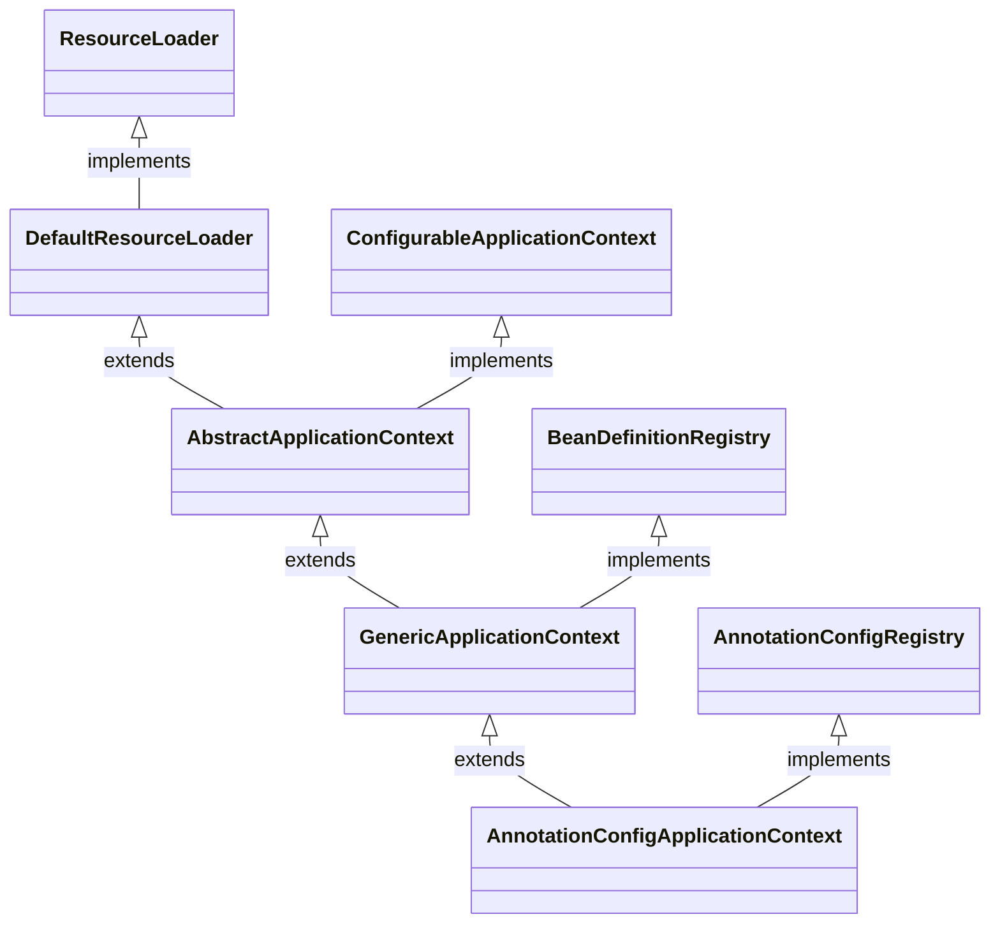

# AnnotationConfigApplicationContext

```mermaid

classDiagram
    GenericApplicationContext <|-- AnnotationConfigApplicationContext : extends
    AbstractApplicationContext <|-- GenericApplicationContext : extends
    DefaultResourceLoader <|-- AbstractApplicationContext : extends
    AnnotationConfigRegistry  <|-- AnnotationConfigApplicationContext:implements
    BeanDefinitionRegistry  <|-- GenericApplicationContext:implements
    ConfigurableApplicationContext  <|-- AbstractApplicationContext:implements
    ResourceLoader  <|-- DefaultResourceLoader:implements
    
    
```