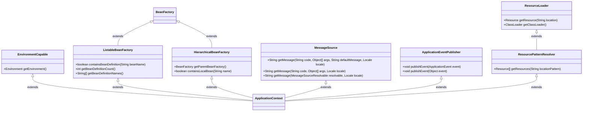

# ApplicationContext

```mermaid

classDiagram
    EnvironmentCapable <|-- ApplicationContext : extends
    ListableBeanFactory <|-- ApplicationContext : extends
    HierarchicalBeanFactory <|-- ApplicationContext : extends
    MessageSource <|-- ApplicationContext : extends
    ApplicationEventPublisher <|-- ApplicationContext : extends
    ResourcePatternResolver <|-- ApplicationContext : extends
    BeanFactory <|-- ListableBeanFactory : extends
    BeanFactory <|-- HierarchicalBeanFactory : extends
    ResourceLoader <|-- ResourcePatternResolver: extends
    
    class EnvironmentCapable {
        +Environment getEnvironment()
    }
    
    class ListableBeanFactory {
        +boolean containsBeanDefinition(String beanName)
        +int getBeanDefinitionCount()
        +String[] getBeanDefinitionNames()
    }
    
    class ResourcePatternResolver {
        +Resource[] getResources(String locationPattern)
    }
    
    class ResourceLoader {
        +Resource getResource(String location)
        +ClassLoader getClassLoader()
    }
    
   
    class ApplicationEventPublisher {
        +void publishEvent(ApplicationEvent event)
        +void publishEvent(Object event)
    }
    class MessageSource {
        +String getMessage(String code, Object[] args, String defaultMessage, Locale locale)
        +String getMessage(String code, Object[] args, Locale locale)
        +String getMessage(MessageSourceResolvable resolvable, Locale locale)
    }
    class HierarchicalBeanFactory {
        +BeanFactory getParentBeanFactory()
        +boolean containsLocalBean(String name)
    }
```