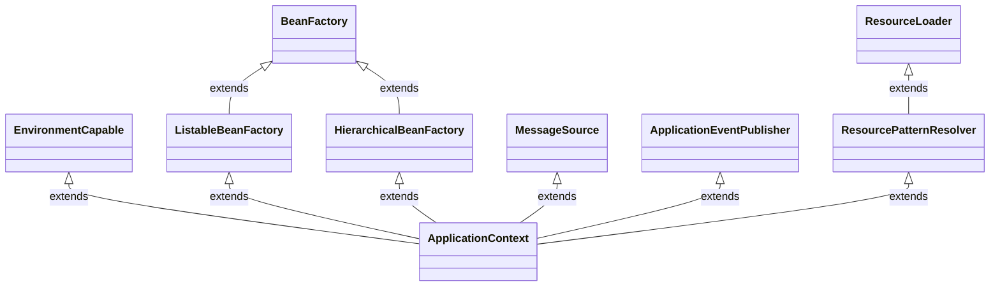
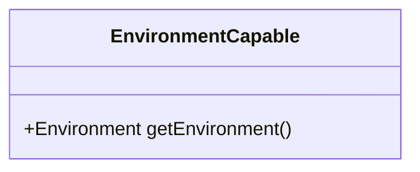
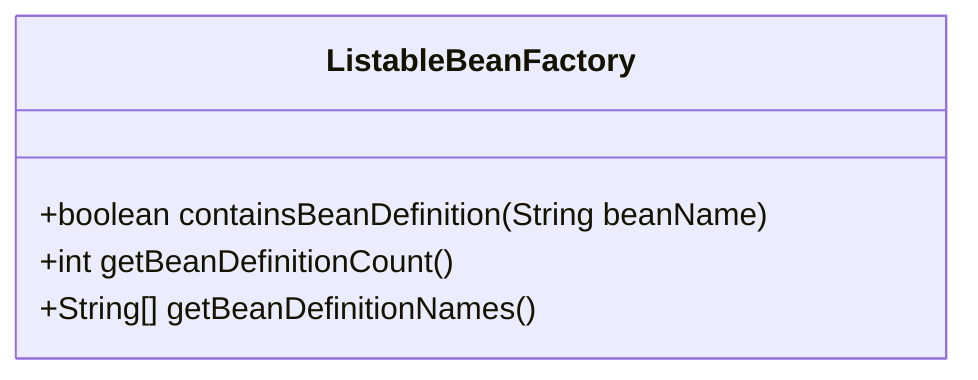
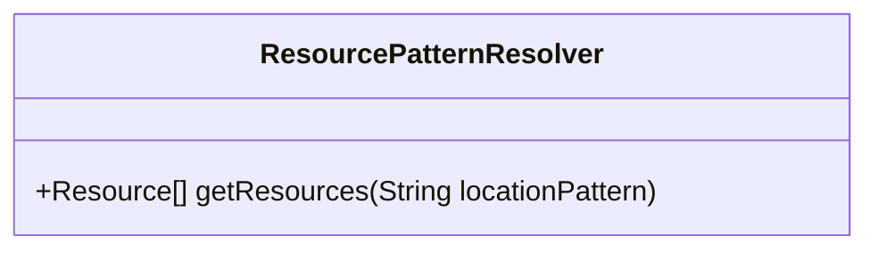
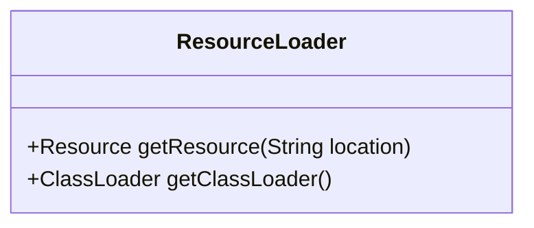
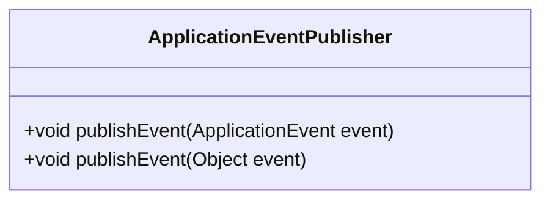
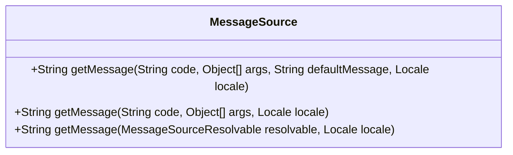
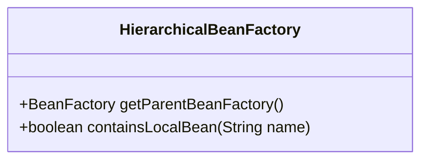

# ApplicationContext

## 继承关系

## 详细内容
### EnvironmentCapable

### ListableBeanFactory

### ResourcePatternResolver

### ResourceLoader

### ApplicationEventPublisher

### MessageSource

### HierarchicalBeanFactory
