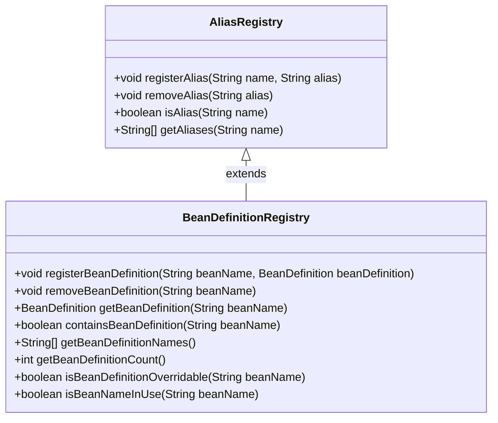

# BeanDefinitionRegistry

```mermaid

classDiagram
    AliasRegistry <|-- BeanDefinitionRegistry : extends
    
    class AliasRegistry {
        +void registerAlias(String name, String alias)
        +void removeAlias(String alias)
        +boolean isAlias(String name)
        +String[] getAliases(String name)
    }
    class BeanDefinitionRegistry {
        +void registerBeanDefinition(String beanName, BeanDefinition beanDefinition)
        +void removeBeanDefinition(String beanName)
        +BeanDefinition getBeanDefinition(String beanName)
        +boolean containsBeanDefinition(String beanName)
        +String[] getBeanDefinitionNames()
        +int getBeanDefinitionCount()
        +boolean isBeanDefinitionOverridable(String beanName)
        +boolean isBeanNameInUse(String beanName)
    }
```