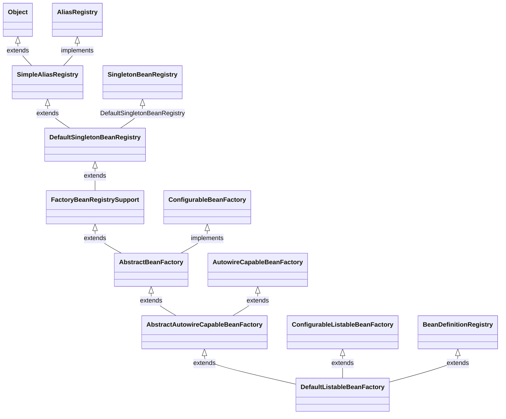

# DefaultListableBeanFactory

```mermaid
classDiagram
    Object <|-- SimpleAliasRegistry: extends
    AliasRegistry <|-- SimpleAliasRegistry: implements
    SimpleAliasRegistry <|-- DefaultSingletonBeanRegistry: extends
    DefaultSingletonBeanRegistry <|-- FactoryBeanRegistrySupport: extends
    SingletonBeanRegistry <|-- DefaultSingletonBeanRegistry: DefaultSingletonBeanRegistry
    FactoryBeanRegistrySupport <|-- AbstractBeanFactory: extends
    AbstractBeanFactory <|-- AbstractAutowireCapableBeanFactory: extends
    AutowireCapableBeanFactory <|-- AbstractAutowireCapableBeanFactory: extends
    ConfigurableBeanFactory <|-- AbstractBeanFactory: implements
    AbstractAutowireCapableBeanFactory <|-- DefaultListableBeanFactory: extends
    ConfigurableListableBeanFactory <|-- DefaultListableBeanFactory: extends
    BeanDefinitionRegistry <|-- DefaultListableBeanFactory: extends
```