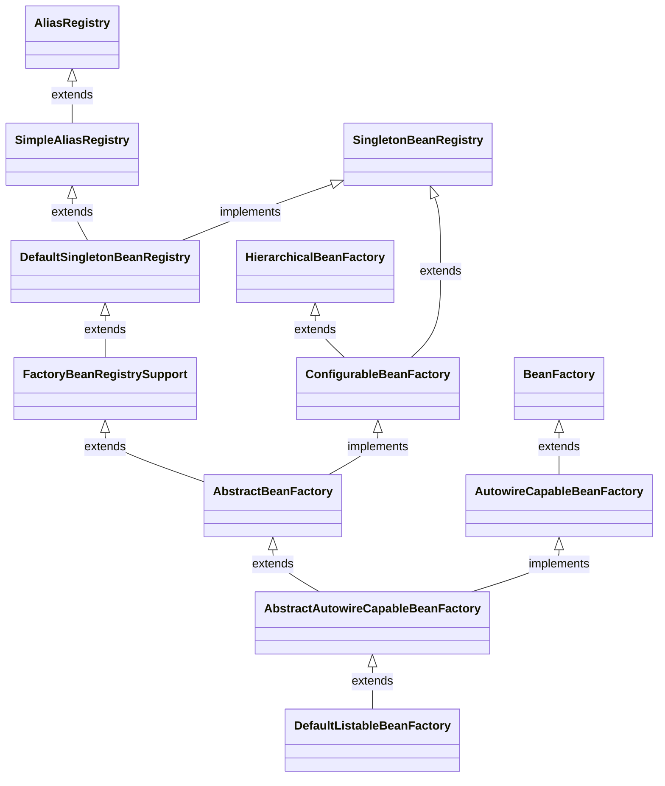

# DefaultSingletonBeanRegistry

```mermaid
classDiagram
    SimpleAliasRegistry <|-- DefaultSingletonBeanRegistry: extends
    SingletonBeanRegistry <|-- DefaultSingletonBeanRegistry: implements
    DefaultSingletonBeanRegistry <|-- FactoryBeanRegistrySupport: extends
    AliasRegistry <|-- SimpleAliasRegistry: extends
    FactoryBeanRegistrySupport <|-- AbstractBeanFactory: extends
    AbstractBeanFactory <|-- AbstractAutowireCapableBeanFactory: extends
    ConfigurableBeanFactory <|-- AbstractBeanFactory: implements
    AutowireCapableBeanFactory <|-- AbstractAutowireCapableBeanFactory: implements
    BeanFactory <|-- AutowireCapableBeanFactory: extends
    HierarchicalBeanFactory <|-- ConfigurableBeanFactory: extends
    SingletonBeanRegistry <|-- ConfigurableBeanFactory: extends
    AbstractAutowireCapableBeanFactory <|-- DefaultListableBeanFactory: extends

```