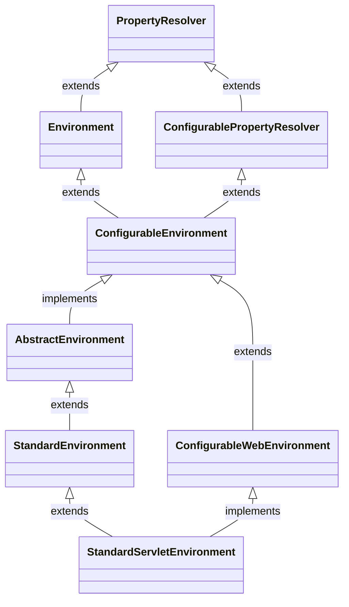

# Environment

```mermaid
classDiagram
    PropertyResolver <|-- Environment: extends
    PropertyResolver <|-- ConfigurablePropertyResolver: extends
    Environment <|-- ConfigurableEnvironment: extends
    ConfigurablePropertyResolver <|-- ConfigurableEnvironment: extends
    ConfigurableEnvironment <|-- ConfigurableWebEnvironment: extends
    AbstractEnvironment <|-- StandardEnvironment: extends
    StandardEnvironment <|-- StandardServletEnvironment: extends
    ConfigurableWebEnvironment <|-- StandardServletEnvironment: implements
    ConfigurableEnvironment <|-- AbstractEnvironment: implements

```