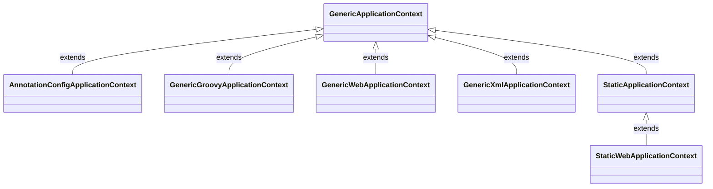

# GenericApplicationContext

```mermaid
classDiagram
    GenericApplicationContext <|-- AnnotationConfigApplicationContext: extends
    GenericApplicationContext <|-- GenericGroovyApplicationContext: extends
    GenericApplicationContext <|-- GenericWebApplicationContext: extends
    GenericApplicationContext <|-- GenericXmlApplicationContext: extends
    GenericApplicationContext <|-- StaticApplicationContext: extends
    StaticApplicationContext <|-- StaticWebApplicationContext: extends
```